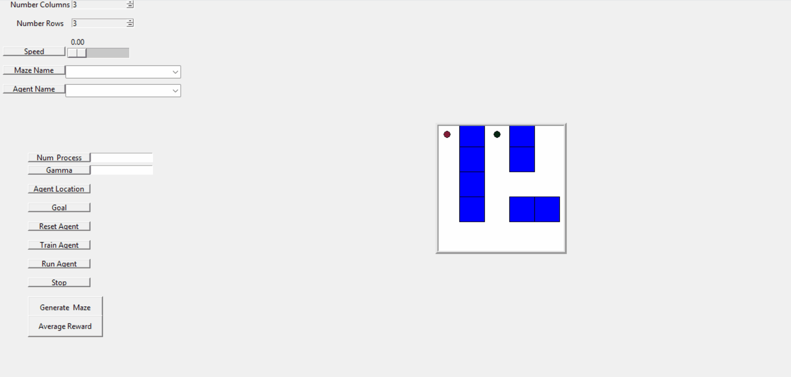

# Tabular RL in a 2D Maze

## Overview

**Tabular_RL_2DMaze** is a small educational project that provides an **introductory overview of Reinforcement Learning (RL)** and demonstrates how classical **tabular RL algorithms** learn in a simple **2D Maze environment**.

This project combines:

- 📘 A **tutorial-style slide report** explaining the fundamental ideas of Reinforcement Learning  
- 🤖 Implementations of several **classical tabular RL algorithms**  
- 🧪 Experiments showing how agents **learn to solve a maze environment**

The goal of this project is to provide a **clear and intuitive introduction to reinforcement learning** for beginners.

---

# Demo

Below is an example of an RL agent learning to solve the maze.

<p align="center">
  
</p>

The agent gradually learns a policy that navigates from the **start state to the goal state** while maximizing cumulative reward.

---

# Reinforcement Learning Tutorial

A **slide-based tutorial** was created to summarize the core ideas of reinforcement learning.

The tutorial is based on the following references:

- *Reinforcement Learning: An Introduction* — Sutton & Barto  
- *Algorithms for Reinforcement Learning* — Csaba Szepesvári  
- Reinforcement Learning lecture materials from **Google DeepMind**

## Topics Covered

The tutorial introduces the key concepts of reinforcement learning:

- Reinforcement Learning fundamentals  
- Agent–Environment interaction  
- Markov Decision Processes (MDP)  
- Value functions  
- Bellman equations  

It also explains several important learning methods:

- Dynamic Programming  
- Monte Carlo methods  
- Temporal Difference learning  
- Importance Sampling  
- N-step bootstrapping  
- Eligibility Traces  
- Exploration vs Exploitation  
- Basic planning ideas in reinforcement learning  

---

## Tutorial Slides

You can view the slide report here:

📄 **Reinforcement Learning Tutorial**

<p align="center">
  <a href="slide_Tutorial_RL.pdf">
    
  </a>
</p>

Or preview the slides directly:

<p align="center">
<iframe src="slides/RL_Tutorial.pdf" width="700" height="450"></iframe>
</p>
---

# 2D Maze Environment

To demonstrate how RL algorithms work, the project uses a **simple 2D Maze environment**.

In this environment:

- The maze is represented as a **grid**
- Each grid cell corresponds to a **state**
- The agent can move in four directions:
  - Up
  - Down
  - Left
  - Right
- The goal of the agent is to **reach the target position** while maximizing cumulative reward

This simple environment makes it easier to observe how different RL algorithms **learn and improve their policies over time**.

---

# Implemented Algorithms

Several classical tabular reinforcement learning algorithms are implemented:

### Q-Learning
### Double Q-Learning
### SARSA
### Monte Carlo Control
### N-step learning
### λ-trace algorithms (e.g. SARSA(λ))
### Monte Carlo Tree Search (MCTS)

These implementations help illustrate how different algorithms update value estimates and gradually learn better policies.

The project supports random maze generation using two classical algorithms.

### DFS Maze Generation

Depth-First Search (DFS) can be used to generate a maze by exploring cells recursively and carving passages between them.

<p align="center">
  
</p>

---

### Prim Maze Generation

Prim's algorithm generates mazes by expanding a frontier of cells and randomly connecting them to the existing maze structure.

<p align="center">
  
</p>
---
# Project Structure
```text
Tabular_RL_2DMaze
│
├── Agent
│ ├── DoubleQlearning.py
│ ├── LambdaTrace.py
│ ├── MCTS.py
│ ├── MonteCarlo.py
│ ├── Nstep.py
│ ├── Qlearning.py
│ └── Sarsa.py
│
├── Env
│ └── maze_space.py # 2D Maze environment
│
├── Random_Maze
│ ├── DFS.py # Maze generation using DFS
│ ├── Prime.py # Maze generation using Prim's algorithm
│ └── maze_generator.py # Maze generator interface
│
└── main.py # GUI program to run and experiment with algorithms
```
